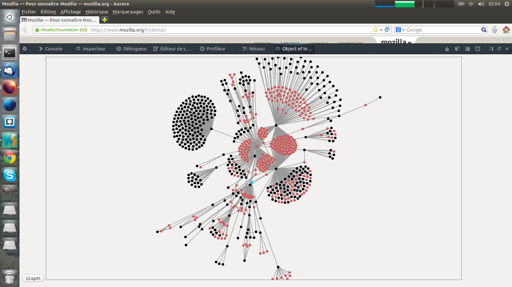

# OoI (project over)

A little addon to visualize object graphs in Firefox.

## History

The purpose of this project was to provide a way to visualize the reference graph of a JavaScript context

The approach i took was to create a Firefox add-on that would add a devtools panel. This panel would visualize the reference graph of the current browser tab

A button was provided to take a snapshot of the graph when the button was clicked

Nodes were objects, colors represents the type (global object, function, other objects, function scope, etc.)\
Edges were links between the objects, colors represented the type of link (object property, `[[prototype]]`, function to its scope, scope to its variables, etc.)

## How it looked like

## Development instructions (irrelevant today)

### dev

1. `npm run build`
1. `npm start`

### build the xpi

1. `npm run xpi`

# Licence

[MIT](./licence)